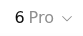

# Real-browser evidence for PRs 451 and 452

These reproducibility scripts and records live on a supporting fork branch so the upstream bug-fix diffs remain focused. They are evidence for the specific tested boundaries, not a claim that every browser/platform/provider combination is covered.

## PR 451: direct-slider readiness

Production builds: baseline `be6c92a9e4cce57c9767dadedb8686669cdf33b6`, candidate `3b7a6b00a2550a54fafa07c24172de6958d1deca`. [The complete final paired run](451/report.json) records the build/module hashes, Chrome version, every observation and both outcomes.

This uses a signed-in real ChatGPT page and the original generated selector. A diagnostic wrapper calls the original readiness resolver and returns its value unchanged. It records real DOM availability, geometry and tier state. No fake DOM, geometry override, CSS override or clock replacement is used. Each trial starts a fresh background page; foreground activation is scheduled 250 ms after the first observed unready result. This is controlled activation timing, not a failure-rate study.

Observed final run:

- Baseline: the simple view was active while its keyboard control was absent; the resolver returned unready and selection failed without arrow input. The closed composer still displayed Extra High.
- Candidate: the first two resolver reads were unready; the control then appeared at approximately 32 px height. One ArrowRight selected Pro. The closed composer displayed `6Pro` afterward.
- Candidate readiness became true before the scheduled foreground request. The foreground schedule and diagnostic procedure were the same for both builds.
- No prompt was submitted. Only test-created tabs were used. The script restores the original tier and closes its own tabs.

 

Earlier [warm-page exploratory trials](451/warm-page-calibration.json) did not exercise the initial-unready branch; they are not used as proof of this fix. The final cold-page paired run is a controlled reproduction, not a measured natural occurrence rate.

Build both pinned revisions with the repository's locked dependencies, then run:

```sh
node scripts/effort-readiness-live-proof.mjs <signed-in-CDP-port> \
  ../baseline/dist/src/browser/actions/thinkingTime.js \
  ./proof-output-451 \
  ../candidate/dist/src/browser/actions/thinkingTime.js
```

This script requires the real direct five-tier slider. Review the output before sharing; the supplied records and cropped images contain no account identity or private endpoint.

## PR 452: dedicated-target isolation

Production builds: baseline `be6c92a9e4cce57c9767dadedb8686669cdf33b6`, candidate `7f8e619afc451da245ad39ac71b0e8f80ec5bba3`.

- [Candidate results](452/candidate.json): 6/6 cases pass.
- [Baseline results](452/baseline.json): the four creation/attachment failure cases connect to a protected sentinel; the two successful dedicated-target cases behave normally.

The script starts an independent temporary headless Chrome and uses real HTTP/WebSocket transport. A loopback proxy injects HTTP 500 for target creation or HTTP 502 for a newly-created target's WebSocket handshake. The proxy records actual WebSocket target IDs; HTTP discovery calls are not mistaken for default-target connections. Control clients connect directly to Chrome and are excluded from those counts.

The matrix covers a fresh temporary profile and reuse of that browser after adding another pre-existing protected page. It checks zero protected-target WebSocket connections on the candidate, unchanged URL/nonce/DOM hashes, no protected-page navigation, and cleanup restricted to created targets. Successful connections also execute and verify a title update on their own target. The proxy uses only generated fixtures; no ChatGPT login or model request is involved.

```sh
CHROME_PATH=/path/to/chrome node scripts/remote-tab-isolation-proof.mjs \
  ../candidate/dist/src/browser/chromeLifecycle.js candidate.json

CHROME_PATH=/path/to/chrome node scripts/remote-tab-isolation-proof.mjs \
  ../baseline/dist/src/browser/chromeLifecycle.js baseline.json
```

The candidate exits 0 with `PROOF_OK`. The baseline intentionally exits nonzero with `PROOF_FAILED`: it violates the same isolation assertions. Both reports record exact module SHA-256 values.

Scope: Linux x64, Chrome 137, unauthenticated temporary profiles, host/port HTTP discovery. This does not verify authenticated profile migration, other operating systems or the separate browser-level WebSocket endpoint path. Acceptance of stopping old fallback-dependent deployments remains the upstream maintainer's decision; explicit `--browser-tab` remains the intentional reuse mechanism.
